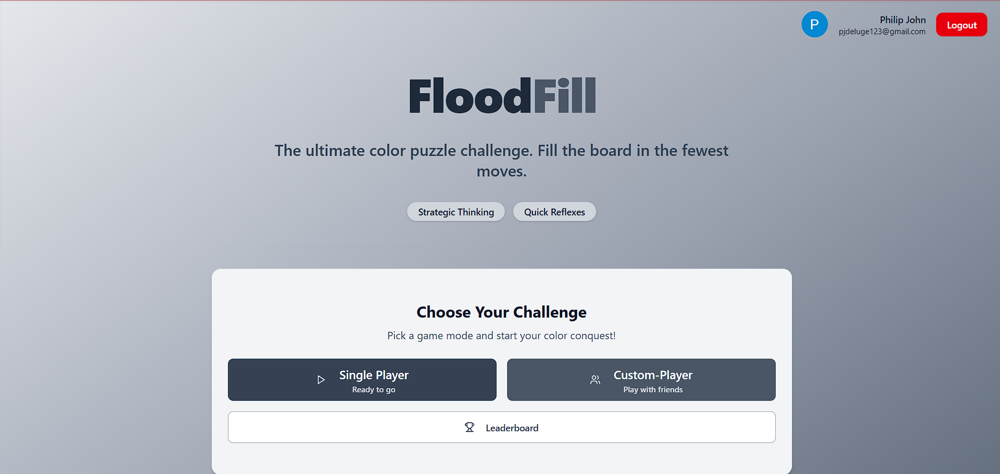
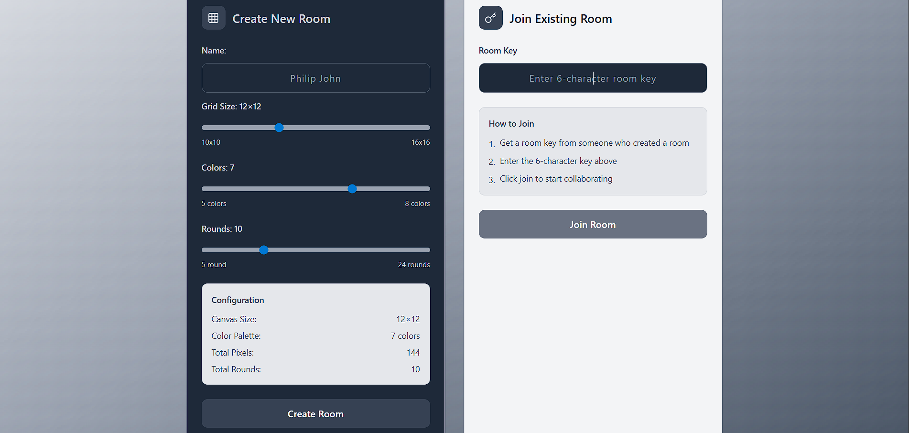
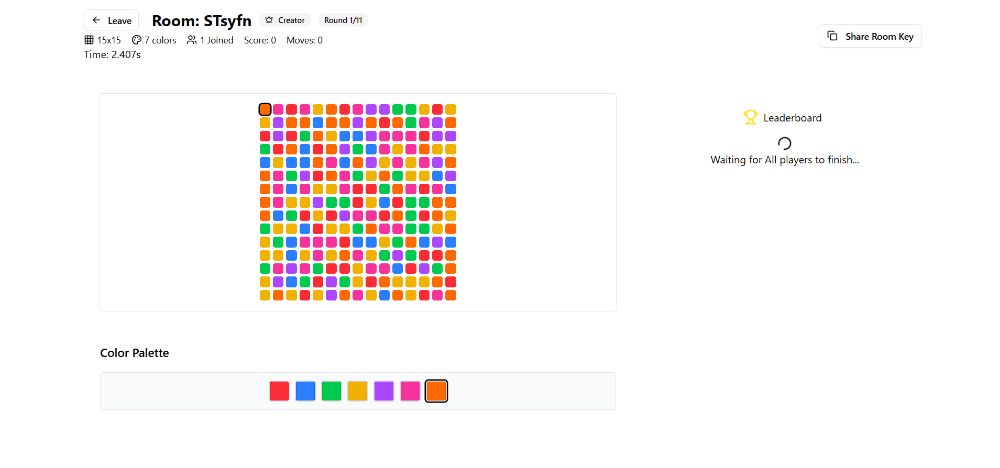
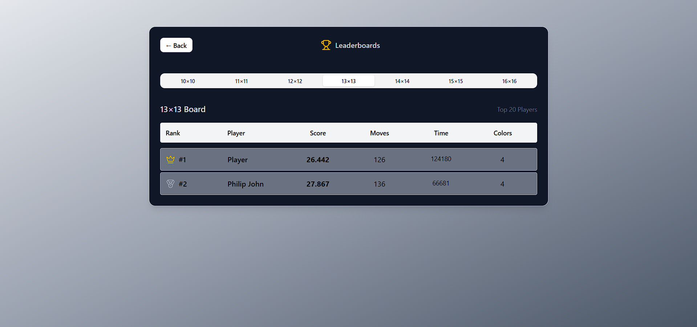

# 🌊 FloodFill Game 

<div align="center">


**A customizable multiplayer game based on the Flood-It algorithm with real-time synchronization and cloud deployment**

</div>

---

## 📸 Screenshots

<details>
<summary>🏠 Landing Page</summary>


*Clean and intuitive landing page with game options*

</details>

<details>
<summary>⚙️ Game Configuration</summary>


*Customizable game settings for creating and joining rooms*

</details>

<details>
<summary>🎮 Game Board</summary>


*Real-time multiplayer game board with flood-fill mechanics*

</details>

<details>
<summary>🏆 Leaderboard</summary>


*Dynamic leaderboard with player statistics and rankings*

</details>

---

## 🚀 Features

### 🎯 Core Gameplay
- **🎮 Single-Player Mode**: Practice and perfect your flood-fill strategy but also get featured in the leaderboard
- **👥 Custom-Player Rooms**: Create or join real-time rooms with friends and get featured in global and local leaderboards
- **⚙️ 342+ Configurations**: Mix and match board sizes, color palettes, and round limits
- **🎨 Dynamic Visuals**: Smooth animations and responsive design- Play with the comfort of your phone or PC!!!

### 🧠 Smart Systems
- **📊 Advanced Scoring**: Custom formula considering:
  - Average moves taken - Given the most importance 
  - Average Time Taken - Given importance when moves are same 
  - Colors Factor - The more the colors you select the more lineancy you get 
- **🏆 Leaderboard Tracking**: Persistent player statistics and rankings
- **📈 Performance Analytics**: Detailed gameplay metrics

### 🌐 Real-Time Features
- **⚡ Live Synchronization**: Powered by Socket.IO for seamless multiplayer
- **🔄 Room Events**: Real-time updates for all players
- **📡 Instant Updates**: Live leaderboard and game state changes

### ☁️ Cloud Infrastructure
- **🔒 Secure Deployment**: HTTPS with SSL certificates
- **🌍 Custom Domain**: Professional domain routing
- **📦 Scalable Storage**: AWS DynamoDB for player data
- **🚀 High Availability**: EC2 deployment with NGINX reverse proxy

---

## 🛠️ Tech Stack

<div align="center">

### Frontend


### Backend & Real-time


### Authentication & Database


### DevOps & Deployment


</div>

---

## 🎮 How to Play

### Flood-Fill Rules
1. **Objective**: Fill the entire board with a single color
2. **Mechanics**: Click a color to flood-fill from the top-left corner
3. **Strategy**: Choose colors that are present in the boundary initially
4. **Victory**: Complete the board with the least num of moves and time

### Game Modes
- **🎯 Single Player**: Play with customizable difficulty
- **👥 Multiplayer**: Compete with friends in real-time rooms
- **🏆 Ranked**: Climb the leaderboard with your best scores

---

## 🚀 Getting Started

### Prerequisites
- **Node.js** (v20 or higher)
- **npm** or **yarn**
- **AWS Account** (for DynamoDB)
- **GitHub OAuth App** (for authentication)

### Installation

1. **Clone the repository**
   ```bash
   git clone https://github.com/yourusername/flood-fill-game.git
   cd flood-fill-game
   ```

2. **Install dependencies**
   ```bash
   npm install
   ```

3. **Environment Setup**
   ```bash
   cp .env.example .env.local
   ```
   
   Configure your environment variables:
   ```env
   # Authentication
   NEXTAUTH_URL=http://localhost:3000
   NEXTAUTH_SECRET=your-secret-key
   GITHUB_CLIENT_ID=your-github-client-id
   GITHUB_CLIENT_SECRET=your-github-client-secret
   
   # AWS Configuration
   AWS_ACCESS_KEY_ID=your-aws-access-key
   AWS_SECRET_ACCESS_KEY=your-aws-secret-key
   AWS_REGION=your-aws-region
   DYNAMODB_TABLE_NAME=flood-fill-leaderboard

   #change other env variables as required by going through the app
   ```

4. **Start Development Server**
   ```bash
   # Make frontend point to localhost port of backend
   # Start both frontend and backend using concurrently
   npm run dev:fullstack
   
   # Or start individually
   npm run dev      # Frontend only
   npm run server   # Backend only
   ```

5. **Open your browser**
   Navigate to `http://localhost:3000`

---

## 📁 Project Structure

```
flood-fill-game/
├── 📁 public/             # Static assets
├── 📁 server/             # Express server and Socket.IO logic-This is for testing purposes and not a real server
├── 📁 screenshots/        # Game screenshots for documentation
├── 📁 src/                # Contains source code ( app, components etc... )
├── 📄 package.json        # Dependencies and scripts
├── 📄 next.config.js      # Next.js configuration
├── 📄 tailwind.config.js  # Tailwind CSS configuration
└── 📄 README.md           # This file
```

---

## 🎯 Game Configuration Options

### Board Sizes
- **10x10 grid**
- **11x11 grid**
- **12x12 grid**
- **13x13 grid**
- **14x14 grid**
- **15x15 grid**
- **16x16 grid**

### Color Palettes
- **Classic**: 5 colors (Easy)
- **Standard**: 6 colors (Medium)
- **Challenge**: 7 colors (Hard)
- **Expert**: 8 colors (Expert)

### Round Limits
- **5 - 24** 

**Total Configurations**: 560+ unique combinations

---

## 🏆 Scoring System

The game uses a sophisticated scoring algorithm that considers:

```javascript
Score = (AverageMoves × 1,000,000 + AverageTime) / ColorFactor

Where:
- AverageMoves = TotalMoves / TotalRounds
- AverageTime = TotalTime / TotalRounds (in milliseconds)
- ColorFactor = 1 + (ColorCount − 5) × 0.15
(Each extra color increases difficulty by 15% and reduces final score)
```

### Ranking Factors
- **🎯 Move Efficiency**: Fewer moves = higher score
- **⏱️ Time Performance**: Faster completion = bonus points
- **🎮 Difficulty Level**: More colors = score multiplier
---


## 🤝 Contributing

We welcome contributions! Please follow these steps:

1. **Fork the repository**
2. **Create a feature branch**
   ```bash
   git checkout -b feature/amazing-feature
   ```
3. **Commit your changes**
   ```bash
   git commit -m 'Add amazing feature'
   ```
4. **Push to the branch**
   ```bash
   git push origin feature/amazing-feature
   ```
5. **Open a Pull Request**

### Development Guidelines
- Follow TypeScript best practices
- Write meaningful commit messages
- Add tests for new features
- Ensure responsive design compatibility

---

## 📝 License

This project is licensed under the MIT License - see the [LICENSE](./LICENSE) file for details.

---

## 📞 Support

Having issues? We're here to help!

- 🐛 **Bug Reports**: [Open an issue](https://github.com/PhilipJohn005/Flood-It-Project/issues)
- 💡 **Feature Requests**: [Start a discussion](https://github.com/PhilipJohn005/Flood-It-Project/discussions)
- 📧 **Email**: philip200.john@gmail.com

---

<div align="center">

**⭐ Star this repository if you found it helpful!**

Made with ❤️ by [Philip](https://github.com/PhilipJohn005)

</div>
